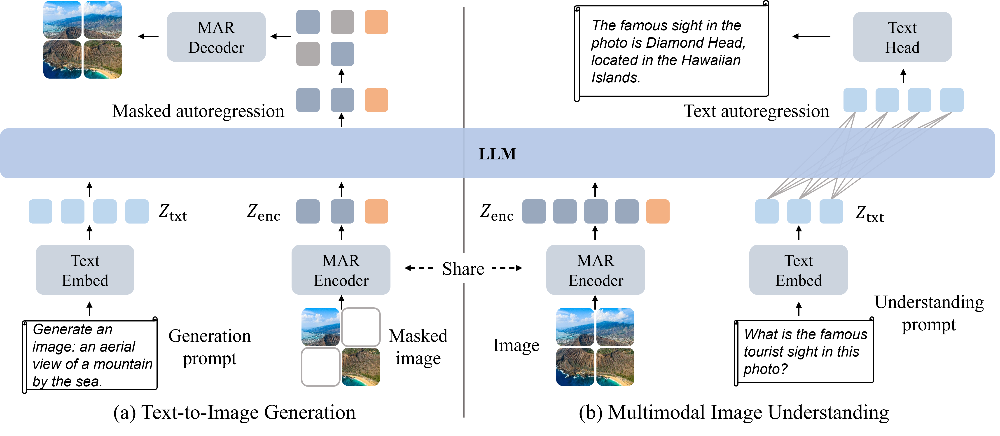

# Harmon: Harmonizing Visual Representations for Unified Multimodal Understanding and Generation



> [**Harmonizing Visual Representations for Unified Multimodal Understanding and Generation**](https://arxiv.org/abs/2406.05821),            
> Size Wu, Wenwei Zhang, Lumin Xu, Sheng Jin, Zhonghua Wu, Qingyi Tao Wentao Liu, Wei Li, Chen Change Loy            
> [Bibtex](https://github.com/wusize/Harmon#citation)

## Introduction

**Harmon** is a novel unified framework for multimodal understanding and generation. Unlike existing state-of-the-art
architectures that disentangle visual understanding and generation with different encoder models, the proposed framework harmonizes
the visual presentations of understanding and generation via a shared MAR encoder. Harmon achieves advanced generation
performance on mainstream text-to-image generation benchmarks, and exhibits competitive results on multimodal understanding
tasks. In this repo, we provide inference code to run Harmon for image understanding (image-to-text) and text-to-image
generation, with two model variants Harmon-0.5B and Harmon-1.5B.

## TODO
- [x] Inference code and model checkpoints
- [ ] Project page
- [ ] Online demo


## Usage

### Required packages
```text
mmengine
transformers==4.45.2
timm==0.9.12
flash_attn==2.3.4
```

### Checkpoints
Obtain checkpoints from [wusize/harmon](https://huggingface.co/wusize/harmon), and arrange the model checkpoints as
```text
Harmon/
├── checkpoints
    ├── kl16.ckpt
    ├── harmon_0.5b.pth
    ├── harmon_1.5b.pth
```
It is recommended to use the following command to download the checkpoints
```bash
# pip install -U "huggingface_hub[cli]"
huggingface-cli download wusize/harmon  --local-dir checkpoints --repo-type model
```


### Image-to-text 


```shell
export PYTHONPATH=./:$PYTHONPATH
python scripts/image2text.py configs/models/qwen2_5_1_5b_kl16_mar_h.py \
         --checkpoint checkpoints/harmon_1.5b.pth  --image_size 512 \
         --image data/view.jpg --prompt "Describe the image in detail."
```

### Text-to-image

```shell
export PYTHONPATH=./:$PYTHONPATH
python scripts/text2image.py configs/models/qwen2_5_1_5b_kl16_mar_h.py \
         --checkpoint checkpoints/harmon_1.5b.pth  --image_size 512 \
         --prompt 'a dog on the left and a cat on the right.'  --output output.jpg
```

**To generate a list of images based on prompts in a json file.**
```shell
export PYTHONPATH=./:$PYTHONPATH
accelerate launch scripts/batch_text2image.py configs/models/qwen2_5_1_5b_kl16_mar_h.py \
       --checkpoint checkpoints/harmon_1.5b.pth  --image_size 512 \
       --data path/to/xxx.json --output output
```
The json file should look like:

```json
[
  {
   "prompt": "a dog on the left and a cat on the right."
  }
]
```


## Citation

```bibtex
@misc{wu2025harmon,
      title={Harmonizing Visual Representations for Unified Multimodal Understanding and Generation}, 
      author={Size Wu and Wenwei Zhang and Lumin Xu and Sheng Jin and Zhonghua Wu and Qingyi Tao and Wentao Liu and Wei Li and Chen Change Loy},
      year={2025},
      eprint={2405.xxxxx},
      archivePrefix={arXiv},
      primaryClass={cs.CV}
}
```

## License
This project is licensed under [NTU S-Lab License 1.0](LICENSE).
